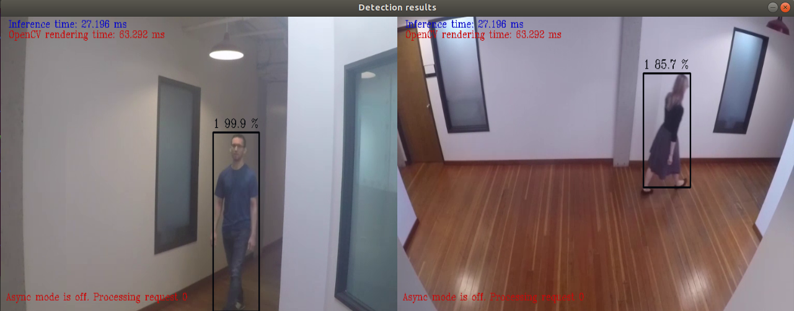

# DISCONTINUATION OF PROJECT #
This project will no longer be maintained by Intel.
Intel has ceased development and contributions including, but not limited to, maintenance, bug fixes, new releases, or updates, to this project.
Intel no longer accepts patches to this project.
# Network Video Recorder

| Details               |                    |
| --------------------- | ------------------ |
| Target OS:            | Ubuntu\* 18.04 LTS |
| Programming Language: | Python 3.5         |
| Time to Complete:     | 45 min             |



## What It Does

The need to accommodate high resolution video for management, storage, and viewing are essential for smart video surveillance systems ensuring the highest standard of security. This solution demonstrates how to implement and take advantage of Intel hardware platforms for an end to end video analytics involving decoding, encoding, and optimization using various media stacks. 

## What You Will Learn

This application uses Intel® Distribution of OpenVINO™ toolkit for encoding and decoding high resolution video streams into a server machine for storage and management.

Gain some insights into the following solutions:

•	Create and run inference workloads that provide low latency video processing <br>
•	Encode and Decode Multiple Video Stream <br>
•	Gather data and send back to the edge and or datacenter <br>

Learn to build and run an application with these capabilities:

1.	Decode and Decode using a multimedia framework library
2.	Transform and resize frames using computer vision
3.	Enable Deep Learning to classify frames
4.	Run filters and count matches in the post-process
5.	Create a detector processor
6.	Optimize solution on various Intel hardware


## Requirements

### Hardware

- UP2* AI Vision Developer Kit + USB webcam

### Software

- [Ubuntu\* 18.04 LTS](http://releases.ubuntu.com/18.04/) <br>
  **Note**: We recommend using a 4.14+ Linux* kernel with this software. Run the following command to determine the kernel version:

    ```
    uname -a
    ```

- Imutils

- OpenCL™ Runtime Package

- Intel® Distribution of OpenVINO™ toolkit 2020 R3 Release

- A multipurpose computer vision solution.

- GStreamer 


## How It Works

This application uses 2 video producing terminals in which their streams are decoded into a server machine.

1. The video streams are captured using the multimedia frameworks and encoded into a format that can be accommodated by the server machine.

2. The stored video in the server machine is then streamed into a computer vision application which performs inference detecting people.

3. This inferred video is then sent to an additional system for further analysis.


## Setup

### Get the code

Clone the reference implementation
```
sudo apt-get update && sudo apt-get install git
git clone https://github.com/intel-iot-devkit/network-video-recorder.git 
```

### Install OpenVINO

Refer to [Install Intel® Distribution of OpenVINO™ toolkit for Linux*](https://software.intel.com/en-us/articles/OpenVINO-Install-Linux) to learn how to install and configure the toolkit.

Install the OpenCL™ Runtime Package to run inference on the GPU, as shown in the instructions below. It is not mandatory for CPU inference.

<!--### Other Dependencies


-->
### Which model to use

This application uses the [person-detection-retail-0013](https://docs.openvinotoolkit.org/2020.3/_models_intel_person_detection_retail_0013_description_person_detection_retail_0013.html) Intel® model, that can be downloaded using the **model downloader**. The **model downloader** downloads the __.xml__ and __.bin__ files that will be used by the application.

To download the models and install the dependencies of the application, run the below command in the `network-video-recorder` directory:
```
./setup.sh
```

### Setup the Environment

Configure the environment to use the Intel® Distribution of OpenVINO™ toolkit by exporting environment variables:

```
source /opt/intel/openvino/bin/setupvars.sh
```

__Note__: This command needs to be executed only once in the terminal where the application will be executed. If the terminal is closed, the command needs to be executed again

### Running The Application

Though the application uses Gstreamer for encoding and decoding high resolution video streams from multiple devices into a server machine for storage and management, it can also use input videos and also camera feed from the host device for the same task.

### Which Input Video to use

The application works with any input video. Sample videos are provided [here](https://github.com/intel-iot-devkit/sample-videos/).

For first-use, we recommend using the *face-demographics walking.mp4* and *people-detection.mp4* video which will be present in the `resources/` directory after the execution of `setup.sh` script.


### Running on the CPU
A user can specify a target device to run on by using the device command-line argument `-d` followed by one of the values `CPU`, `GPU`,`MYRIAD` or `HDDL`.<br>

Though by default application runs on CPU, this can also be explicitly specified by  ```-d CPU``` command-line argument:

```
python3 network_video_recorder.py -d CPU -i ./resources/face-demographics-walking.mp4 -i2 ./resources/people-detection.mp4 -m /opt/intel/openvino/deployment_tools/open_model_zoo/tools/downloader/intel/person-detection-retail-0013/FP32/person-detection-retail-0013.xml

```

To run the application on sync mode, use `-f sync` as command line argument. By default, the application runs on async mode.

To run with multiple devices use -d MULTI:device1,device2. For example: -d MULTI:CPU,GPU,MYRIAD<br>

### Running on the GPU
* To run on the integrated Intel® GPU with floating point precision 32 (FP32), use the `-d GPU` command-line argument:

```
python3 network_video_recorder.py -d GPU -i ./resources/face-demographics-walking.mp4 -i2 ./resources/people-detection.mp4 -m /opt/intel/openvino/deployment_tools/open_model_zoo/tools/downloader/intel/person-detection-retail-0013/FP32/person-detection-retail-0013.xml

```

 **FP32**: FP32 is single-precision floating-point arithmetic uses 32 bits to represent numbers. 8 bits for the magnitude and 23 bits for the precision. For more information, [click here](https://en.wikipedia.org/wiki/Single-precision_floating-point_format)<br>

* To run on the integrated Intel® GPU with floating point precision 16 (FP16):

```
python3 network_video_recorder.py -d GPU -i ./resources/face-demographics-walking.mp4 -i2 ./resources/people-detection.mp4 -m /opt/intel/openvino/deployment_tools/open_model_zoo/tools/downloader/intel/person-detection-retail-0013/FP16/person-detection-retail-0013.xml

```

**FP16**: FP16 is half-precision floating-point arithmetic uses 16 bits. 5 bits for the magnitude and 10 bits for the precision. For more information, [click here](https://en.wikipedia.org/wiki/Half-precision_floating-point_format)

**Note:** With GPU, there is a known issue of improper detections where the detections for one of the input videos overlaps with the other one.

### Running on the Intel® Neural Compute Stick
To run on the Intel® Neural Compute Stick, use the ```-d MYRIAD``` command-line argument:

```
python3 network_video_recorder.py -d MYRIAD -i ./resources/face-demographics-walking.mp4 -i2 ./resources/people-detection.mp4 -m /opt/intel/openvino/deployment_tools/open_model_zoo/tools/downloader/intel/person-detection-retail-0013/FP16/person-detection-retail-0013.xml

```

### Running on the Intel® Movidius™ VPU
To run on the Intel® Movidius™ VPU, use the ```-d HDDL ``` command-line argument:

```
python3 network_video_recorder.py -d HDDL -i ./resources/face-demographics-walking.mp4 -i2 ./resources/people-detection.mp4 -m /opt/intel/openvino/deployment_tools/open_model_zoo/tools/downloader/intel/person-detection-retail-0013/FP16/person-detection-retail-0013.xml

```

**Note:** The Intel® Movidius™ VPU can only run FP16 models. The model that is passed to the application, through the `-m <path_to_model>` command-line argument, must be of data type FP16.
    

If the user wants to use any other videos, they can be used by providing the associated path in the above command.


### Using the Camera Stream instead of video

The command to be executed when we want to use the camera stream is a s follows:

```
python3 network_video_recorder.py -i cam -i2 cam -m /opt/intel/openvino/deployment_tools/open_model_zoo/tools/downloader/intel/person-detection-retail-0013/FP32/person-detection-retail-0013.xml
```

In this case also, the user can specify a target device to run on by using the device command-line argument `-d` followed by one of the values `CPU`, `GPU`,`MYRIAD` or `HDDL`.<br> 


### Using Gstreamer

Follow the following steps to display person detection results on a host machine from separate indepenedent individual system feeds.

1. Stream camera with Gstreamer on Up-Squared board:
```
$ gst-launch-1.0 -v v4l2src device=/dev/video0 ! "image/jpeg,width=640, height=480,framerate=30/1" ! rtpjpegpay ! udpsink host=<host_ip> port=5000
```

2. Stream camera with Gstreamer on Up-Squared board 2:
```
gst-launch-1.0 -v v4l2src device=/dev/video0 ! "image/jpeg,width=640, height=480,framerate=30/1" ! rtpjpegpay ! udpsink host=<host_ip> port=5001
```

3. Run detection script on host machine:
```
python3 network_video_recorder.py -i gstreamer -i2 gstreamer -m /opt/intel/openvino/deployment_tools/open_model_zoo/tools/downloader/intel/person-detection-retail-0013/FP32/person-detection-retail-0013.xml
```

Similar to the input video and camera scenarios, the detction script can be run on host machine using any of the target device that the user desires by using the device command-line argument `-d` followed by one of the values `CPU`, `GPU`,`MYRIAD` or `HDDL`.<br>

